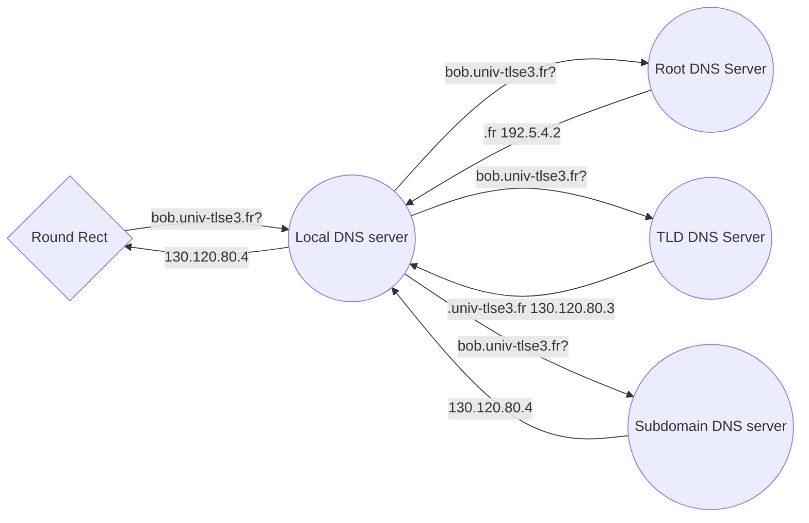

Mini DNS server project
===================
What DNS server has to do? Right, take URL and transform it to some IP address.  This project is a demonstration of how it works
-------------------
What is DNS?
----------
When your enter some URL in your browser, computer knows nothing about server that hold the page you want. It needs some address to connect. To get this address, we have to resolve it with hierarchy of DNS servers.
Every URL has several levels  of sub-domain. For example : 

    bob.univ-tlse3.fr
has 3 level of domain (separated by dots) 

 - .fr - root domain of french zoone
 - univ-tlse - **T**op **L**evel **D**omain (**TLD**), server of first level
 - bob. - server that we actually wants

Every part of this URL is known only by appropriate DNS server. So, to simplify this, in reality, we make only one request to local DNS server that make all necessary request itself.

Now, we suppose that  server and computer don't have their cache. So every our request will walk through the whole DNS hierarchy (root, TLD, authority, etc).  Also, only root server is known by local server.

 1.  If site address is not found in cache, your computer starts to make requests of address resolution to your **local** DNS server.
 2. **Local** DNS server starts with request to **root** (*.fr*) server about location of the **TLD** server, responsible for french zone
 3. **Local** server now is capable to resolve site location of *univ-tlse3* domain by requesting it from **TLD** server
 4. *univ-tlse* found and *local* server makes final request to Authority server
 5. Authority server responds with address of bob.univ-tlse3.fr
 6.  **Local** server returns this address to computer
This project just demonstrate this algorithm.

Installation
-------------
Make sure you have gcc installed and just enter  

	   make *version*
 List of all available versions 
 
| Name  | Comment |
|--|--|--|
| dns_client | makes request to local DNS server
|dns_server_v0| implementation of authority server (3rd in hierarchy)|
|dns_server_v1| implementation of TLD/ROOT server using UDP protocol
|dns_server_local_v1| implementation of local DNS server using UDP protocol
|dns_server_v2| implementation of TLD/ROOT server using TCP protocol
|dns_server_local_v2| implementation of local DNS server using TCP protocol

Launching & Usage
-------------
To start using server, you have to run and configure all 4 type of server. You can do it by launching them automatically :

    make tests
And then start to us it by typing 

    . /dns_client −s 127.0.0.1 −p 5300 www.univ−tlse3.fr
   Which is equivalent to 

    dig bob.univ−tlse3.fr @127.0.0.1 −p 5300 +short
Or run each manually starting with root: 

    ./dns_server_v1 RR/univ-tlse3.fr.conf 12700 &
	./dns_server_v1 RR/wikipedia.fr.conf 12827 &
	./dns_server_v1 RR/tld.fr.conf 1270 &
	./dns_server_v1 RR/root.conf 8888 &
	./dns_server_local_v1 5300 &
***Note** : server ports must be matched !*

To make some tests :

    make test_v1 #test UDP version
    make test_v2 #to test TCP version

Have fun ;)
